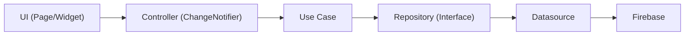

# Arquitetura do Sistema (Clean Architecture)

Este documento descreve a estrutura arquitetural oficial do ABADÁ APP. O projeto adota os princípios da Clean Architecture (Arquitetura Limpa) organizados por funcionalidades (Features), visando o desacoplamento de código, facilitando os testes automatizados, a manutenibilidade e a escalabilidade


## 1. Estrutura de Pastas (/lib)

```
lib/
├── core/       # Configurações globais, serviços essenciais, erros e utilitários
├── shared/     # Componentes visuais, modais e DTOs reutilizáveis por múltiplas features
└── features/   # Módulos de funcionalidades do sistema (Vertical Slicing)
```

## 2. Camada Global (/core)

A pasta /core armazena tudo o que é transversal ao aplicativo, ou seja, configurações e serviços que não pertencem a uma funcionalidade específica.

```
lib/core/
├── /app/        
├── /constants/ 
├── /errors/    
├── /providers/ 
├── /services/  
└── /utils/  
```

- **/app**: Inicializadores e configurações principais do aplicativo (ex: app_initializer.dart).

- **/router**: Gerenciador de rotas. Cadastra e disponibiliza todas as rotas disponíveis no aplicativo.

- **/constants**: Arquivos de constantes globais. Inclui nomes de coleções do Firebase, paletas de cores, dimensões de espaçamento, etc.

- **/services**: Serviços de infraestrutura externa, como gateway de pagamento, armazenamento local (SharedPreferences/SecureStorage) e serviços de imagem.

- **/providers**: Gerenciamento da injeção de dependências. Contém os arquivos que registram os ChangeNotifiers (ex: profile_providers.dart) e o arquivo central providers_injection.dart (onde os providers são agrupados para a injeção no MultiProvider, no aquivo **main.dart**).

- **/errors**: Tratamento de exceções e classes de erro customizadas (Failure classes).

- **/utils**: Funções utilitárias, formatadores de data, máscaras de CPF, etc.

## 3. Camada de Funcionalidades (/features)

Cada funcionalidade do sistema (ex: Autenticação, Turmas, Eventos, TUSCA) possui sua própria pasta dentro de /features. Cada feature é estritamente dividida em três camadas estruturais:

```
lib/features/nome_feature/
├── presentation/
│   ├── controllers/
│   ├── pages/
│   └── widgets/
├── domain/
│   ├── entities/
│   ├── repositories/
│   └── usecases/
└── data/
    ├── datasources/
    ├── models/
    └── repositories/
```

- ### 3.1 Presentation (Apresentação)

  Responsável por tudo o que o usuário vê e interage, além do controle de estado da interface. Não possui regras de negócio diretas.

  - **/pages**: Telas do aplicativo. Interfaces exibidas ao usuário.

    - **Nomenclatura**: Sufixo `_page.dart` (Ex: `profile_page.dart`).
  
  - **/widgets**: Componentes visuais menores que compôem as páginas, isolados para reuso interno da página.

    - **Nomenclatura**: Sufixo `_widget.dart` (Ex: `profile_image_widget.dart`).

  - **/controllers**:  Lógica de estado da tela. Estende *ChangeNotifier*, armazenam o estado da interface, intermedeia a comunicação entre a UI e os Use Cases da camada de domínio, notificam a tela sobre mudanças. Garantem consistência das informações digitadas pelo usuário.

    - **Nomenclatura**: Sufixo `_controller.dart` (Ex: `profile_form_controller.dart`).

- ### 3.2 Domain (Domínio)

  O coração do sistema. Contém as regras de negócio mais intrínsecas. 100% e completamente independente do Flutter, do banco de dados ou de qualquer biblioteca ou API externa.

  - **/entities**: Objetos de negócio puros. Representam os dados essenciais da funcionalidade e parâmetros de requisição.

    - **Nomenclatura**: Sufixo `_entity.dart` (Ex: `user_entity.dart`). 
  
  - **/repostories ou /repository**: Contratos (Interfaces/Classes Abstratas) que define quais métodos de persistência a camada de dados deverá implementar. Define o contrato de como os dados devem ser obtidos/salvos, sem saber qual banco será usado.

    - **Nomenclatura**: Sufixo `_repository.dart` (Ex: `user_repository.dart`).

  - **/usecases**: Regras de negócio de caso de uso. Cada arquivo executa uma ação específica do sistema (ex: *ValidateStudentVinculum*, *CalculateTuscaStatus*). Possui apenas uma responsabilidade no sistema (*SRP* - *Single Responsibility Principle*). Validam dados e conversam diretamente com os contratos dos repositorios.

    - **Nomenclatura**: Sufixo `_usecase.dart` (Ex: `update_user_profile_usecase.dart`)

- ### 3.3 Data (Dados)

  Responsável por saber como buscar, salvar e converter os dados a partir de fontes externas (Firebase, API REST ou Banco de Dados Local)

  - **/datasources**: Conexão direta com a fonte dados (operações CRUD). Dividido em contrato (interfaces ou classes abstratas) e implementação.

    - **Nomenclatura (Contrato)**: Sufixo `_datasource.dart` (Ex: `profile_datasource.dart`).

    - **Nomenclatura (Implementação)**: Sufixo `_datasource_impl.dart` (Ex: `profile_datasource_impl.dart`)

  - **/repositories ou /repository**: Implementação concreta do dados definidos em **/domain/repository**. Chamam os contratos dos datasources diretamente. Sabem exatamente qual datasource chamar.

    - **Nomenclatura**: Sufixo `_repository_impl` (Ex: `user_repository.impl.dart`)

  - **/models**: Extensões diretas das entities de domain especializadas em serialização (conversão de dados JSON/Firestore para objetos Dart). Convertem dados externos para Entities no domínio através de métodos como toEntity() e fromMap().

    - **Nomenclatura**: Sufixo `_model.dart` (Ex: `user_entity_model.dart`);


## 4. Tratamento Funcional de Erros com Either ('fpadart' / 'dartz')

Para garantir a previsibilidade e evitar o lançamento de exceções não tratadas (`try-catch` espalhados pela UI), o projeto adota o tipo monádico `Either<L, R>` em todas as operações assíncronas do backend e das camadas internas.

  - ### 4.1 Conceito do Either

    A classe `Either<L, R>` representa um valor que pode assumir um de dois tipos possíveis:
    * **Left (`L`):** Representa o lado do **Erro/Falha** (sempre uma subclasse de `Failure` localizada em `core/errors`).
    * **Right (`R`):** Representa o lado do **Sucesso** (pode retornar uma `Entity`, uma `List<Entity>` ou `void` para ações de alteração sem retorno de dados).

  - ### 4.2 Aplicação do Either no código

    - #### Contrato de Repositories e Use Cases e Datasources

      Todas as assinaturas de métodos nas interfaces do `Domain` e `Data` (Repositories, Use Cases e Datasources) devem retornar um `Future<Either<Failure, T>>`.

      ```dart
        // Exemplo de Use Case com retorno de Entity
        abstract class GetUserProfileUseCase {
          Future<Either<Failure, UserEntity>> call(String userId);
        }

        // Exemplo de Use Case sem retorno de dados (Void)
        abstract class DeleteAccountUseCase {
          Future<Either<Failure, void>> call(String userId);
        }
      ```
    - #### Implementações de Datasoucources

      ```dart
        // Exemplo de DatasourceImpl
        class ProfileDatasourceImpl implements ProfileDatasource {

          
          // Função com retorno de entidade
          @override
          Future<Either<Failure, UserEntity>> getUserByUserId(String userId){
            try{

              final userData = externalApi.getUserById(userId);

              return Right(userData);  // retorna o sucesso para a direita

            } catch(exception){
              return ExceptionHandler.handleException(exception, contextMessage: 'getUserByUserId'); // retorna a falha para a esquerda
            }
          }

          // Função sem nenhum retorno
          @override
          Future<Either<Failure, UserEntity>> deleteUserByUserId(String userId){
            try{

              final userData = externalApi.deleteUserById(userId);

              return Right(null);  // retorna o sucesso para a direita

            } catch(exception){

              return ExceptionHandler.handleException(exception, contextMessage: 'deleteUserByUserId'); // retorna a falha para a esquerda

            }
          }
        }
      ```

  - ### 4.3 Consumo no Controller via `.fold()`

    O `Controller` consome o Use Case utilizando o método `.fold(onLeft, onRight)`. Esse método força o desenvolvedor a tratar obrigatoriamente os dois caminhos possíveis antes de atualizar a UI e disparar o notifyListeners()

    ```dart 
    
      class ProfileController extends ChangeNotifier {
        final GetUserProfileUseCase _getUserProfileUseCase;

        ProfileController(this._getUserProfileUseCase);

        UserEntity? user;
        String? errorMessage;
        bool isLoading = false;

        Future<bool> loadProfile(String userId) async {
          isLoading = true;
          notifyListeners();

          final result = await _getUserProfileUseCase(userId);

          final success = result.fold(
            (failure) {
              // Caminho do ERRO (Left)
              errorMessage = failure.message;
              user = null;

              return false;
            },
            (successUser) {
              // Caminho do SUCESSO (Right)
              user = successUser;
              errorMessage = null;

              return true;
            },
          );

          isLoading = false;
          notifyListeners();

          return success;
        }
      }
    ```
  
## 5. Componentes Comuns (/shared)

  Pasta dedicada a elementos e componentes que são consumidos por múltiplas features, mas que não configuram o aplicativo em si(como botões padronizados, caixas de diálogo genéricas, temas globais, componentes de formulário).

  - **Nomenclatura**: Sufixo `_widget.dart` (Ex: `text_form_widget.dart`).


## 6. Fluxo de Dados na Prática

Para implementar qualquer funcionalidade, o fluxo de chamadas deve respeitar rigorosamente o caminho abaixo. 



```

[ Ação do usuário na página ]
       │
       ▼
[ Controller chama o UseCase ]
       │
       ▼
[ UseCase valida a RN e chama o Repository (Domain) ]
       │
       ▼
[ RepositoryImpl (Data) chama o DatasourceImpl ]
       │
       ▼
[ Datasource executa a query no Firebase e retorna UserModel ]
       │
       ▼
[ RepositoryImpl converte UserModel em UserEntity ]
       │
       ▼
[ Controller recebe a Entity, atualiza o estado e avisa a Page (notifyListeners) ]

```

**A comunicação de dependências deve sempre ser de fora para dentro.**

  

## 7. Regra de Ouro da Arquitetura

  - **A camada `Domain` NUNCA importa nada de `Data` ou `Presentation`**
  - **A camada `Presentation` NUNCA chama `Datasource` diretamente**. Sempre passe pelo `Controller` --> `Usecase`
  - **Evite Controllers "God Class"**: Se a tela faz muitas coisas diferentes, crie sub-controllers ou divida a tela em widgets menores com seus próprios estados.
  - **Repeite a nomenclatura**: Os sufixos (`_page`, `_widget`, `_controller`, `_usecase`, `_repository_impl`) são obrigatórios para facilitar as buscas no projeto.
  - **Nunca adicione a lógica de conversão JSON (fromMap) nas Entities:** Isso pertence exclusivamente às models.

